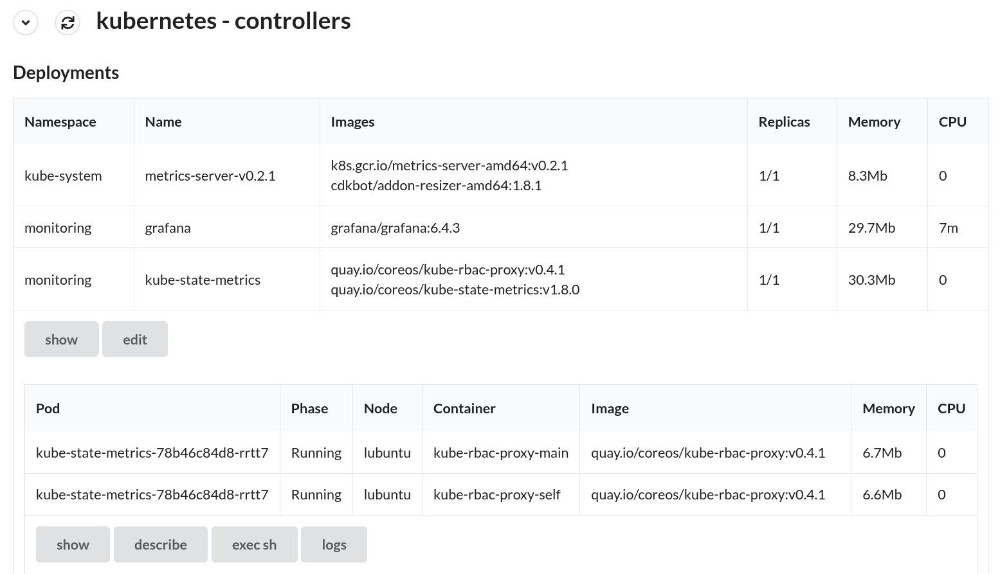

# cmd-frontend

Simple web-based front-ends for arbitrary commands. An attempt to combine the power & rapid iteration of command-line development with the usability advantages of a GUI (e.g. sortable tables, inline documentation, buttons for common actions, etc...).

* Designed to be highly secure
  * Server code in one easy to audit .js file
  * Only commands whitelisted on the server can run
  * No server-side dependencies except Node.js
* Designed for easy customisation & development
  * No compilation steps - TypeScript is loaded using [@babel/standalone](https://babeljs.io/docs/en/babel-standalone) - just refresh the page to run updated code
  * Scripts use an API ([frontend/types.d.ts](frontend/types.d.ts)) that decouples them from rendering the UI or executing commands

Each "script directory" contains sub-directories with js files and cmd files. Each js file represents a page that becomes available from the front-end. When the page is opened the corresponding script's `load` function is run - it can ask the server to run cmd files in its subdirectory, load the results and display a web-based GUI.

# Usage

```bash
node cmd-frontend-server.js [script directories]

e.g.
node cmd-frontend-server.js panels/
open http://localhost:9876
# no npm install!
```

# Included scripts / panels

Basic functionality should be working:

* Kubernetes (controllers, pods)
* systemd (units)
* Linux process statuses
* Windows services
* BOINC and Folding@Home statuses

Work in progress:

* gcloud (e.g. listing Compute Engine VMs)
* Qubes GUI

# Screenshots

## Linux processes


## Kubernetes


Some buttons show information as modal popups, others copy CLI commands into the clipboard.

# Example script

Here is the code behind the systemd units table:

`ListUnits.cmd`
```bash
#! /bin/bash
busctl call org.freedesktop.systemd1 /org/freedesktop/systemd1 org.freedesktop.systemd1.Manager ListUnits --json=pretty 
```

`units.js`
```js
export async function load({ runCommand, setData }) {
    const json = await runCommand("ListUnits")
    const data = JSON.parse(json).data[0]

    const rows = data.map(([name, description, loadState, activeState, subState, following, path, jobId, jobType, jobPath]) => (
        {
            cells: [name, loadState, activeState, subState, description],
            key: name,
        }
    ))

    setData({
        fields: ["Name", "Load", "Active", "Sub-state", "Description"],
        rows,
    })
}
```

# Development setup

Run the server, edit scripts and refresh the page:

```bash
nodemon cmd-frontend-server.js panels/ panels-wip/
```

Modifying the frontend is nicer with TypeScript so you can optionally run `npm install` on a development machine to install types.

```bash
npm install # for TypeScript @types/node
cd frontend
npm install
```

`npx @pika/web` is used to bundle dependencies into `frontend/web_modules` after adding them to `webDependencies` in `frontend/package.json`.

# Roadmap / Wishlist

* Running commands on multiple machines through PubSub, HTTP and/or SSH
* Charts (e.g. for CPU usage, temperature)
* Charts with persistent data


# Thanks to these projects

* Node.js
* React
* [Semantic UI React](https://react.semantic-ui.com/)
* TypeScript
* Babel
* [htm.js](https://github.com/developit/htm)
* [Pika](https://www.pika.dev)
* [Prism](https://prismjs.com/)
* [prism-react-renderer](https://github.com/FormidableLabs/prism-react-renderer)
* [React JSON Inspector](https://github.com/Lapple/react-json-inspector)
* [timeago.js](https://github.com/hustcc/timeago.js)
* Visual Studio Code